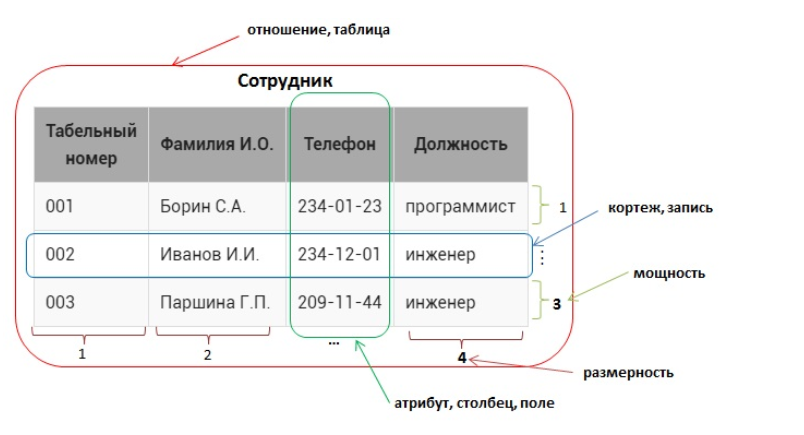

# Основы реляционной модели и SQL

В данном модуле рассматриваются основные понятия реляционной модели, а также различные виды SQL запросов к одной таблице базы данных.

## 1.1 Отношение (таблица)

## Последовательность написания команд (! отличается от последовательности выполнения команд в запросе)
```sql
SELECT 'столбцы или * для выбора всех столбцов; обязательно'
FROM 'таблица; обязательно'
WHERE 'условие/фильтрация, например, city = 'Moscow'; необязательно'
GROUP BY 'столбец, по которому хотим сгруппировать данные; необязательно'
HAVING 'условие/фильтрация на уровне сгруппированных данных; необязательно'
ORDER BY 'столбец, по которому хотим отсортировать вывод; необязательно'
```


## Содержание урока:

- [основные понятия реляционных баз данных](#основные-понятия-реляционных-баз-данных)
- [отношение(таблица)](#отношение-таблица)
- [используемые типы данных](#используемые-типы-данных)
- [создание таблицы SQL запросом](#создание-таблицы)
- [добавление данных SQL запросом](#добавление-данных)

### Основные понятия реляционных баз данных

[Содержание ↑](#11-отношение-таблица)

Реляционная модель определяет способ представления данных(структуру данных), методы защиты данных(целостность данных),
и операции, которые можно выполнять с данными(манипулирование данных). Эта модель лежит в основе всех реляционных баз данных.

**Основные принципы реляционных баз данных**
- все данные на концептуальном уровне представляются в виде объектов, заданных в виде строк и столбцов, называемых **отношением (таблица)**
- в пересечении строки и столбца таблицы можно занести только одно значение
- все операции выполняются над целыми **отношениями** и результатом этих операций являются **отношения**

**Пример отношения**



На примере таблицы Сотрудник рассмотрим терминологию реляционных баз данных:

- **отношение**  – это структура данных целиком, набор записей (в обычном понимании – таблица) , в  примере –это Сотрудник;
- **кортеж** – это каждая строка , содержащая данные (более распространенный термин – запись ), например, <001, Борин С.А, 234-01-23, программист>, все кортежи в отношении должны быть различны;
- **мощность** – число кортежей в таблице (проще говоря, число записей), в данном случае 3, мощность отношения может быть любой (от 0 до бесконечности), порядок следования кортежей - неважен;
- **атрибут** – это столбец в таблице (более распространенный термин – поле ), в примере – Табельный номер, Фамилия И.О., Телефон, Должность) 
- **размерность** – это число атрибутов в таблице, в данном случае – 4;
размерность отношения должна быть больше 0, порядок следования атрибутов существенен;
- **домен атрибута** – это допустимые значения (неповторяющиеся), которые можно занести в поле , например для атрибута Должность домен – {инженер, программист}.

### Отношение (таблица)

[Содержание ↑](#11-отношение-таблица)

**Отношение, реляционная модель**

Рассмотрим некоторый склад, на котором хранятся книги. Известно название книги, ее автор, количество экземпляров на складе и ее цена.
Всю эту информацию можно представить в виде таблицы, состоящей из 4 столбцов (приведено только 4 записи, на самом деле их значительно больше)

|      Название      |       Автор      | Цена, руб | Количество |
|:------------------:|:----------------:|:---------:|:----------:|
| Мастер и Маргарита | Булгаков М.А.    | 670.99    | 3          |
| Белая гвардия      | Булгаков М.А.    | 540.50    | 5          |
| Идиот              | Достоевский Ф.М. | 460       | 10         |
| Братья Карамазовы  | Достоевский Ф.М. | 799.01    | 2          |

**Перед созданием таблицы в базе данных необходимо описать ее структуру. Для этого выполняется следующая последовательность шагов**
1. Дать таблице имя, пусть будет `book`, **правила для выбора имен таблиц:**
    - может включать английские буквы, цифры и знак подчеркивания, должно начинаться с буквы;
    - имя должно быть уникальным в пределах базы данных.
    
Также **рекомендуется:**

- чтобы имя было существительным в единственном числе;
- имя должно быть понятным и соответствовать тому объекту, который оно описывает;
- имя должно быть как можно короче, максимум до 10 символов.

2. Определить структуру таблицы, из каких атрибутов(столбцов, полей) она будет состоять,  в нашем случае это:
    - `title` – поле для хранения названия книги;
    - `author` – поле с фамилией автора книги ;
    - `priсe` – цена книги;
    - `amount` – количество книг.

**Правила по выбору имени поля информационного объекта:**

- может включать английские буквы, цифры и знак подчеркивания, должно начинаться с буквы;
- имя поля должно быть уникальным в пределах таблицы.

**Рекомендации по выбору имени поля информационного объекта:**

- имя должно быть понятным и соответствовать тем данным, которые хранятся в поле;
- имя может состоять из нескольких слов, тогда слова разделяются подчеркиванием, после подчеркивания слово пишется с маленькой буквы.

3. Включить ключевое поле `book_id`, которое является ОБЯЗАТЕЛЬНЫМ ЭЛЕМЕНТОМ каждой реляционной таблицы. Ключевое поле является уникальным для каждой записи, однозначно определяет запись и в дальнейшем будет использоваться для **связей** с другими таблицами.

**Рекомендации по именованию  ключевых полей:**

- имя должно состоять  из двух частей: начинаться с названия таблицы, которой поле принадлежит, затем через подчеркивание необходимо указать `id`.

Таким образом, наша таблица `book` будет выглядеть следующим образом:

| book_id |        title       |      author      |  price | amount |
|:-------:|:------------------:|:----------------:|:------:|:------:|
| 1       | Мастер и Маргарита | Булгаков М.А.    | 670.99 | 3      |
| 2       | Белая гвардия      | Булгаков М.А.    | 540.50 | 5      |
| 3       | Идиот              | Достоевский Ф.М. | 460    | 10     |
| 4       | Братья Карамазовы  | Достоевский Ф.М. | 799.01 | 2      |


### Используемые типы данных
[Содержание ↑](#11-отношение-таблица)

**Numeric Types**
|       Name       | Storage Size |           Description          |                                           Range                                          |
|:----------------:|:------------:|:------------------------------:|:----------------------------------------------------------------------------------------:|
|     smallint     |    2 bytes   |       small-range integer      |                                     -32768 to +32767                                     |
|      integer     |    4 bytes   |   typical choice for integer   |                                -2147483648 to +2147483647                                |
|      bigint      |    8 bytes   |       large-range integer      |                        -9223372036854775808 to 9223372036854775807                       |
|      decimal     |   variable   | user-specified precision,exact | up to 131072 digits before the decimal point; up to 16383 digits after the decimal point |
|      numeric     |   variable   | user-specified precision,exact | up to 131072 digits before the decimal point; up to 16383 digits after the decimal point |
|       real       |    4 bytes   |   variable-precision,inexact   |                                6 decimal digits precision                                |
| double precision |    8 bytes   |   variable-precision,inexact   |                                15 decimal digits precision                               |
|    smallserial   |    2 bytes   | small autoincrementing integer |                                        1 to 32767                                        |
|      serial      |    4 bytes   |    autoincrementing integer    |                                      1 to 2147483647                                     |
|     bigserial    |    8 bytes   | large autoincrementing integer |                                 1 to 9223372036854775807                                 |

**Character Types**
| No. |                       Name & Description                      |
|:---:|:-------------------------------------------------------------:|
|  1  | character varying(n), varchar(n)   variable-length with limit |
|  2  | character(n), char(n)   fixed-length, blank padded            |
|  3  | text   variable unlimited length                              |

**Date/Time Types**
|                 Name                 | Storage Size |             Description            |     Low Value    |    High Value   |
|:------------------------------------:|:------------:|:----------------------------------:|:----------------:|:---------------:|
| timestamp [(p)] [without time zone ] |    8 bytes   |  both date and time (no time zone) |      4713 BC     |    294276 AD    |
|              TIMESTAMPTZ             |    8 bytes   | both date and time, with time zone |      4713 BC     |    294276 AD    |
|                 date                 |    4 bytes   |        date (no time of day)       |      4713 BC     |    5874897 AD   |
|   time [ (p)] [ without time zone ]  |    8 bytes   |        time of day (no date)       |     00:00:00     |     24:00:00    |
|      time [ (p)] with time zone      |   12 bytes   |  times of day only, with time zone |   00:00:00+1459  |  24:00:00-1459  |
|       interval [fields ] [(p) ]      |   12 bytes   |            time interval           | -178000000 years | 178000000 years |

**Boolean type**
|   Name  | Storage Size |       Description      |
|:-------:|:------------:|:----------------------:|
| boolean |    1 byte    | state of true or false |

**Определим тип данных для каждого поля таблицы **book****
- `book_id` - ключевой столбец, целое число, которое должно генерироваться автоматически
- `title` - строка текста, ее длина выбирается в зависимости от данных, которые предполагается хранить в поле, предположим, что название книги не превышает 50 символов - `VARCHAR(50)`
- `author` - строка текста - `VARCHAR(30)`
- `priсe` - для описание денежного значения используется числовой тип данных с двумя знаками после запятой - `DECIMAL(8,2)`
- `amount` - целое число - `INT`


### Создание таблицы

[Содержание ↑](#11-отношение-таблица)

Для создания таблицы используется `SQL-запрос`. В нем указывается какая таблица создается, их каких атрибутов(полей) она состоит и какой тип данных имеет каждое поле

- ключевые слова `CREATE TABLE`
- имя создаваемой таблицы
- открывающая круглая скобка `(`
- название поля и его описание, которое включает тип и другие необязательные характеристики
- ...
- закрывающая круглая скобка `)`

genre:

|    Поле    |          Тип, описание         |
|:----------:|:------------------------------:|
| genre_id   | INT PRIMARY KEY AUTO_INCREMENT |
| name_genre | VARCHAR(30)                    |

```sql

CREATE TABLE genre(
    genre_id SERIAL PRIMARY KEY,
    name_genre VARCHAR(30)
)
```

**Рекомендации по записи SQL запроса**

- Ключевые слова: SQL не является регистрозависимым языком (`CREATE` и `create` - одно и тоже ключевое слово). 
- Ключевые слова SQL и типы данных рекомендуется  записывать прописными (большими) буквами.
- Имена таблиц и полей - строчными (маленькими) буквами.
- SQL-запрос можно писать на нескольких строках.
- В конце SQL-запроса ставится точка с запятой (хотя если Вы пишете один запрос, это необязательно).

### Добавление данных

[Содержание ↑](#11-отношение-таблица)

**Для занесения новой записи в таблицу используется SQL запрос, в котором указывается в какую таблицу, в какие поля заносить новые значения. Структура запроса:**

- ключевые слова `INSERT INTO` (ключевое слово `INTO` можно пропустить);
- имя таблицы, в которую добавляется запись;
- открывающая круглая скобка `(`;
- список полей через запятую, в которые следует занести новые данные;
- закрывающая скобка `)`;
- ключевое слово `VALUES`;
- открывающая круглая скобка `(`;
- список значений через запятую, которые заносятся в соответствующие поля, при этом текстовые значения заключаются в кавычки, числовые значения записываются без кавычек, в качестве разделителя целой и дробной части используется точка;
- закрывающая скобка `)`.

**Вставим новую запись в таблицу genre, созданную на предыдущем шаге ( в первых двух строках показана структура таблицы, далее - ее содержимое):**

```sql
INSERT INTO genre (name_genre)
VALUES ('Роман');
```

**Можно указать сразу несколько кортежей**

```sql
INSERT INTO genre (name_genre) VALUES
    ('Роман'),
    ('Петр'),
    ('Максим');
```