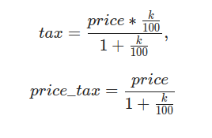

# Основы реляционной модели и SQL

## 1.2 Выборка данных

## Содержание урока

В этом уроке будет рассмотрен синтаксис и семантика следующих SQL запросов:

- [выборка всех данных из таблицы](#выборка-всех-данных-из-таблицы)
- [выборка данных из отдельных столбцов](#выборка-данных-из-отдельных-столбцов)
- [присвоение новых имен столбцам при формировании выборки;](#присвоение-новых-имен-столбцам-при-формировании-выборки)
- [создание вычисляемых столбцов](#создание-вычисляемых-столбцов)
- [вычисляемые столбцы, математические функции](#вычисляемые-столбцы-математические-функции)
- [вычисляемые столбцы, логические функции](#вычисляемые-столбцы-логические-функции)
- [выборка данных по простому условию](#выборка-данных-по-простому-условию )
- [выборка данных с использованием логических выражений и операций](#выборка-данных-с-использованием-логических-выражений-и-операций)
- [выборка данных, операторы BETWEEN, IN](#выборка-данных-операторы-between-in)
- [выборка данных с сортировкой.](#выборка-данных-с-сортировкой)
- [выборка текстовых данных по шаблону, оператор LIKE](#выборка-текстовых-данных-по-шаблону-оператор-like)


**Структура и наполнение таблицы**

|             book_id            |         title         |      author      |     price    | amount |
|:------------------------------:|:---------------------:|:----------------:|:------------:|:------:|
| INT PRIMARY KEY AUTO_INCREMENT |      VARCHAR(50)      |    VARCHAR(30)   | DECIMAL(8,2) |   INT  |
| 1                              | Мастер и Маргарита    | Булгаков М.А.    | 670.99       | 3      |
| 2                              | Белая гвардия         | Булгаков М.А.    | 540.50       | 5      |
| 3                              | Идиот                 | Достоевский Ф.М. | 460.00       | 10     |
| 4                              | Братья Карамазовы     | Достоевский Ф.М. | 799.01       | 2      |
| 5                              | Стихотворения и поэмы | Есенин С.А.      | 650.00       | 15     |


## Выборка всех данных из таблицы

[Содержание ↑](#содержание-урока)

Для того чтобы отобрать все данные из таблицы используется SQL запрос следующей структуры: 

- ключевое слово `SELECT`; 
- символ `*` ; 
- ключевое слово `FROM`; 
- имя таблицы.

**Пример**:
Выбрать все записи таблицы `book` 

```sql
    SELECT * FROM book;
```

**Результат**


| book_id | title                 | author           | price  | amount |
|:-------:|:---------------------:|:----------------:|:------:|:------:|
| 1       | Мастер и Маргарита    | Булгаков М.А.    | 670.99 | 3      |
| 2       | Белая гвардия         | Булгаков М.А.    | 540.50 | 5      |
| 3       | Идиот                 | Достоевский Ф.М. | 460.00 | 10     |
| 4       | Братья Карамазовы     | Достоевский Ф.М. | 799.01 | 2      |
| 5       | Стихотворения и поэмы | Есенин С.А.      | 650.00 | 15     |


## Выборка данных из отдельных столбцов

[Содержание ↑](#содержание-урока)

Для того чтобы отобрать данные из определенных столбцов таблицы используется SQL запрос следующей структуры: 

- ключевое слово `SELECT` ; 
- список столбцов таблицы через запятую; 
- ключевое слово `FROM` ; 
- имя таблицы.

**Результатом является таблица, в которую включены все данные из указанных после `SELECT` столбцов исходной таблицы.**

**Пример**

Выбрать названия книг и их количества из таблицы book

```sql
    SELECT title, amount FROM book;
```

**Результат**

 
|title                  | amount |
|:---------------------:|:------:|
| Мастер и Маргарита    | 3      | 
| Белая гвардия         | 5      | 
| Идиот                 | 10     | 
| Братья Карамазовы     | 2      | 
| Стихотворения и поэмы | 15     |


## Присвоение новых имен столбцам при формировании выборки

[Содержание ↑](#содержание-урока)

Для того чтобы отобрать данные из определенных столбцов таблицы и одновременно задать столбцам новые названия в результате выборки используется SQL запрос следующей структуры: 

- ключевое слово `SELECT` ; 
- имя столбца;
- ключевое слово `AS` ; 
- новое название столбца (можно русскими буквами), выводимое в результате запроса, но это должно быть одно слово, если название состоит из двух слов – соединяйте их подчеркиванием, например, Количество_книг; 
- запятая; 
- имя столбца; 
- ....
- ключевое слово `FROM` ; 
- имя таблицы.


В одном запросе можно использовать и имена столбцов из таблицы, и новые названия.

Результатом является таблица, в которую включены все данные из указанных после `SELECT` столбцов исходной таблицы. Каждому столбцу в результате запроса присваивается новое имя, заданное после `AS`, или столбец получает имя столбца исходной таблицы, если `AS` отсутствует.

**Пример**

Выбрать все названия книг и их количества из таблицы `book` , для столбца `title` задать новое имя `Название`.

```sql
    SELECT title AS Название, amount
    FROM book;
```
**Результат**


| Название              | amount |
|:---------------------:|:------:|
| Мастер и Маргарита    | 3      |
| Белая гвардия         | 5      | 
| Идиот                 | 10     |
| Братья Карамазовы     | 2      |
| Стихотворения и поэмы | 15     |


## Создание вычисляемых столбцов

[Содержание ↑](#содержание-урока)

С помощью SQL запросов можно осуществлять вычисления по каждой строке таблицы с помощью вычисляемого столбца. Для него в списке полей после оператора `SELECT` указывается выражение и задается имя.

Выражение может включать имена столбцов, константы, знаки операций, встроенные функции.

Результатом является таблица, в которую включены все данные из указанных после `SELECT` столбцов, а также новый столбец, в каждой строке которого вычисляется заданное выражение.

**Пример**

Вывести всю информацию о книгах, а также для каждой позиции посчитать ее стоимость (произведение цены на количество). Вычисляемому столбцу дать имя total .

```sql
    SELECT title, author, price, amount,
        price * amount AS total
    FROM book;
```

**Результат**


| title                 | author           | price  | amount | total   | 
|:---------------------:|:----------------:|:------:|:------:|:-------:|
| Мастер и Маргарита    | Булгаков М.А.    | 670.99 | 3      | 2012.97 | 
| Белая гвардия         | Булгаков М.А.    | 540.50 | 5      | 2702.50 | 
| Идиот                 | Достоевский Ф.М. | 460.00 | 10     | 4600.00 | 
| Братья Карамазовы     | Достоевский Ф.М. | 799.01 | 2      | 1598.02 | 
| Стихотворения и поэмы | Есенин С.А.      | 650.00 | 15     | 9750.00 |


## Вычисляемые столбцы, математические функции

[Содержание ↑](#содержание-урока)

В SQL реализовано множество [математических функций](https://learn.microsoft.com/ru-ru/sql/t-sql/functions/mathematical-functions-transact-sql?view=sql-server-ver15) для работы с числовыми данными. В таблице приведены некоторые из них.

|   Функция   |                                                 Описание                                                |                Пример                |
|:-----------:|:-------------------------------------------------------------------------------------------------------:|:------------------------------------:|
| CEILING(x)  | возвращает наименьшее целое число, большее или равное x  			(округляет до целого числа в большую сторону)  | CEILING(4.2)=5  			CEILING(-5.8)=-5     |
| ROUND(x, k) | округляет значение x до k знаков после запятой,  			если k не указано – x округляется до целого            | ROUND(4.361)=4  			ROUND(5.86592,1)=5.9 |
| FLOOR(x)    | возвращает наибольшее целое число, меньшее или равное x  			(округляет до  целого числа в меньшую сторону) | FLOOR(4.2)=4  			FLOOR(-5.8)=-6         |
| POWER(x, y) | возведение x в степень y                                                                                | POWER(3,4)=81.0                      |
| SQRT(x)     | квадратный корень из x                                                                                  | SQRT(4)=2.0  			SQRT(2)=1.41...         |
| DEGREES(x)  | конвертирует значение x из радиан в градусы                                                             | DEGREES(3) = 171.8...                |
| RADIANS(x)  | конвертирует значение x из градусов в радианы                                                           | RADIANS(180)=3.14...                 |
| ABS(x)      | модуль числа x                                                                                          | ABS(-1) = 1  			ABS(1) = 1              |
| PI()        | pi = 3.1415926...                                                                                       |                                      |


**Пояснение**

Существуют разные способы округления чисел. В SQL реализовано математическое округление. Для округления вещественного числа нужно в записи числа выбрать разряд в дробной части, до которого производится округление. Цифра, записанная в выбранном разряде: не меняется, если следующая за ней справа цифра - 0, 1, 2, 3 или 4; увеличивается на единицу, если следующая за ней справа цифра - 5,6,7,8 или 9.


**Пример**

Для каждой книги из таблицы book вычислим налог на добавленную стоимость (имя столбца `tax`) , который включен в цену и составляет `k = 18%`,  а также цену книги (`price_tax`) без него. Формулы для вычисления:




Эта формула НДС отвечает на вопрос "Какую сумму увеличили на 18%, чтобы получить текущее значение"

```sql
    SELECT title, price,
        (price * (18.0 / 100) / 1 + (18.0 / 100)) AS tax,
        (price / (1 + (18.0 / 100))) AS price_tax
    FROM book;
```

**Результат**

|title             |price |tax                       |price_tax               |
|:----------------:|:----:|:------------------------:|:----------------------:|
|Мастер и Маргарита|670.99|120.9582000000000000000000|568.63559322033898305085|
|Белая гвардия     |540.50| 97.4700000000000000000000|458.05084745762711864407|
|Идиот             |460.00| 82.9800000000000000000000|389.83050847457627118644|
|Братья Карамазовы |799.01|144.0018000000000000000000|677.12711864406779661017|

**Но по заданию необходимо округлить до 2х знаков**

```sql
    SELECT title, price,
        ROUND(
            (price * (18.0 / 100) / (1 + 18.0 / 100)), 2
        ) AS tax,

        ROUND (
            price / (1 + 18.0 / 100)
            , 2) as price_tax
    FROM book;
```

**Результат**

title             |price |tax   |price_tax|
|:---------------:|:----:|:----:|:-------:|
Мастер и Маргарита|670.99|102.35|   568.64|
Белая гвардия     |540.50| 82.45|   458.05|
Идиот             |460.00| 70.17|   389.83|
Братья Карамазовы |799.01|121.88|   677.13|


## Вычисляемые столбцы, логические функции

[Содержание ↑](#содержание-урока)

В SQL реализована возможность заносить в поле значение в зависимости от условия. Для этого используется функция `IF()`

`IF(логическое выражение, выражение_1, выражение_2)`

Функция вычисляет логическое_выражение, если оно истина – в поле заносится значение `выражения_1`, в противном случае –  значение `выражения_2`. Все три параметра `IF()` являются обязательными.

Допускается использование вложенных функций, вместо выражения_1 или выражения_2 может стоять новая функция `IF`.

**Пример**

Для каждой книги из таблицы book установим скидку следующим образом: если количество книг меньше 4, то скидка будет составлять 50% от цены, в противном случае 30%.

```sql
    SELECT title, amount, price,
        CASE
            WHEN amount < 4 THEN price * 0.5
            ELSE price * 0.7
        END AS sale
    FROM book;
```

Результат:


| title                 | amount | price  | sale    |
|:---------------------:|:------:|:------:|:-------:|
| Мастер и Маргарита    | 3      | 670.99 | 335.495 |
| Белая гвардия         | 5      | 540.50 | 378.350 |
| Идиот                 | 10     | 460.00 | 322.000 |
| Братья Карамазовы     | 2      | 799.01 | 399.505 |
| Стихотворения и поэмы | 15     | 650.00 | 455.000 |


Цена по скидке должна отображаться с двумя знаками после запятой, добавим в запрос округление:

```sql
    SELECT title, amount, price,
        ROUND(
            CASE
                WHEN amount < 4 THEN price * 0.5
                ELSE amount * 0.7
            END
        ,2) as sale
    FROM book;
```

Результат:


| title                 | amount | price  | sale   |
|:---------------------:|:------:|:------:|:------:|
| Мастер и Маргарита    | 3      | 670.99 | 335.50 |
| Белая гвардия         | 5      | 540.50 | 378.35 |
| Идиот                 | 10     | 460.00 | 322.00 |
| Братья Карамазовы     | 2      | 799.01 | 399.51 |
| Стихотворения и поэмы | 15     | 650.00 | 455.00 |


Усложним вычисление скидки в зависимости от количества книг. Если количество книг меньше 4 – то скидка 50%, меньше 11 – 30%, в остальных случаях – 10%. И еще укажем какая именно скидка на каждую книгу.

```sql
    SELECT title, amount, price,
        ROUND(
            CASE
                WHEN amount < 4 THEN price * 0.5
                WHEN amount < 11 THEN price * 0.7
                ELSE price * 0.9
            END
        , 2) as sale,

        CASE
            WHEN amount < 4 THEN 'скидка 50%' 
        	else
	            case
	        		when amount < 11 THEN 'скидка 30%'
	        		else 'скидка 10%'
	        	end
        END as "Ваша_скидка"

    FROM edu.book;
```

Результат:


| title                 | amount | price  | sale   | Ваша_скидка |
|:---------------------:|:------:|:------:|:------:|:-----------:|
| Мастер и Маргарита    | 3      | 670.99 | 335.50 | скидка 50%  |
| Белая гвардия         | 5      | 540.50 | 378.35 | скидка 30%  |
| Идиот                 | 10     | 460.00 | 322.00 | скидка 30%  |
| Братья Карамазовы     | 2      | 799.01 | 399.51 | скидка 50%  |
| Стихотворения и поэмы | 15     | 650.00 | 585.00 | скидка 10%  |


## Выборка данных по простому условию

[Содержание ↑](#содержание-урока)


С помощью запросов можно включать в итоговую выборку не все строки исходной таблицы, а только те, которые отвечают некоторому условию. Для этого после указания таблицы, откуда выбираются данные, задается ключевое слово WHERE и логическое выражение, от результата которого зависит будет ли включена строка в выборку или нет. Если условие – истина, то строка(запись)  включается в выборку, если ложь – нет.

Логическое выражение может включать операторы сравнения:
- равно `«=»`
- не равно `«<>»`
- больше `«>»`
- меньше `«<»`
- больше или равно `«>=»`
- меньше или равно `«<=»`
- выражения, допустимые в SQL.

**Пример**

Вывести название и цену тех книг, цены которых меньше 600 рублей.

```sql
    select title, price
    from book
    where price < 600;
```

Результат:


| title         | price  |
|:-------------:|-------:|
| Белая гвардия | 540.50 |
| Идиот         | 460.00 |


**Пример**

Вывести название, автора  и стоимость (цена умножить на количество) тех книг, стоимость которых больше 4000 рублей

```sql
select title, author, price * amount as total
from edu.book
where price * amount > 4000;
```

Результат:


| title                 | author           | total   |
|:---------------------:|:----------------:|:-------:|
| Идиот                 | Достоевский Ф.М. | 4600.00 |
| Стихотворения и поэмы | Есенин С.А.      | 9750.00 |


## Выборка данных с использованием логических выражений и операций

[Содержание ↑](#содержание-урока)


 Логическое выражение после ключевого слова WHERE кроме операторов сравнения  и выражений может включать  логические операции (И «and», ИЛИ «or», НЕ «not») и круглые скобки, изменяющие приоритеты выполнения операций.

Приоритеты операций:

- круглые скобки
- умножение  (*),  деление (/)
- сложение  (+), вычитание (-)
- операторы сравнения (=, >, <, >=, <=, <>)
- NOT
- AND
- OR

**Пример**

Вывести название, автора и цену тех книг, которые написал Булгаков, ценой больше 600 рублей

```sql
select title, author, price
from edu.book
where author ='Булгаков М.А.' and price > 600;
```

Результат:


| title              | author        | price  |
|:------------------:|:-------------:|:------:|
| Мастер и Маргарита | Булгаков М.А. | 670.99 |


Пример

Вывести название, цену  тех книг, которые написал Булгаков или Есенин, ценой больше 600 рублей

```sql
select title, author, price
from edu.book
where (author = 'Булгаков М.А.' or author = 'Есенин С.А.') and price > 600;
```


## Выборка данных, операторы BETWEEN, IN

[Содержание ↑](#содержание-урока)


Логическое выражение после ключевого слова WHERE может включать операторы  `BETWEEN` и `IN`. Приоритет  у этих операторов такой же как у операторов сравнения, то есть они выполняются раньше, чем `NOT`, `AND`, `OR`.

Оператор `BETWEEN` позволяет отобрать данные, относящиеся к некоторому интервалу, `включая его границы`.

**Пример**

Выбрать названия и количества тех книг, количество которых от 5 до 14 включительно.

```sql
select title, amount 
from edu.book
where amount between 5 and 14;

-- analog
WHERE amount >= 5 AND amount <=14;
```


| title         | amount |
|:-------------:|:------:|
| Белая гвардия | 5      |
| Идиот         | 10     |


Оператор  `IN`  позволяет выбрать данные, соответствующие значениям из списка.

**Пример**

Выбрать названия и цены книг, написанных Булгаковым или Достоевским.

```sql
select title, price
from edu.book
where author in ('Булгаков М.А.', 'Достоевский Ф.М.');

-- analog
WHERE author = 'Булгаков М.А.' OR author = 'Достоевский Ф.М.';
```


| title              | price  |
|:------------------:|:------:|
| Мастер и Маргарита | 670.99 |
| Белая гвардия      | 540.50 |
| Идиот              | 460.00 |
| Братья Карамазовы  | 799.01 |


## Выборка данных с сортировкой

[Содержание ↑](#содержание-урока)


При выборке можно указывать столбец или несколько столбцов, по которым необходимо отсортировать отобранные строки. Для этого используются ключевые слова `ORDER BY`, после которых задаются имена столбцов. При этом строки сортируются по первому столбцу, если указан второй столбец, сортировка осуществляется только для тех строк, у которых значения первого столбца одинаковы. По умолчанию `ORDER BY` выполняет сортировку по возрастанию. Чтобы управлять направлением сортировки вручную, после имени столбца указывается ключевое слово `ASC` (по возрастанию) или `DESC` (по убыванию). asc от ascending - возрастающий и соответственно desc от descending - убывающий

Столбцы после ключевого слова `ORDER BY` можно задавать:

- названием столбца;
- номером столбца;
- именем столбца (указанным после AS).

**Пример**

Вывести название, автора и цены книг. Информацию  отсортировать по названиям книг в алфавитном порядке.

```sql
select title, author, price
from edu.book
order by title;
```


| title                 | author           | price  |
|:---------------------:|:----------------:|:------:|
| Белая гвардия         | Булгаков М.А.    | 540.50 |
| Братья Карамазовы     | Достоевский Ф.М. | 799.01 |
| Идиот                 | Достоевский Ф.М. | 460.00 |
| Мастер и Маргарита    | Булгаков М.А.    | 670.99 |
| Стихотворения и поэмы | Есенин С.А.      | 650.00 |


Аналогичный результат
`ORDER BY 1;`

**Пример**

Вывести автора, название и количество книг, в отсортированном в алфавитном порядке по автору и по убыванию количества, для тех книг, цены которых меньше 750 рублей.

```sql
select author, title, amount as Количество
from edu.book
where price < 750
order by author, amount desc;
```


| author           | title                 | Количество |
|:----------------:|:---------------------:|:----------:|
| Булгаков М.А.    | Белая гвардия         | 5          |
| Булгаков М.А.    | Мастер и Маргарита    | 3          |
| Достоевский Ф.М. | Идиот                 | 10         |
| Есенин С.А.      | Стихотворения и поэмы | 15         |


Можно использовать другие варианты записи запроса:

```sql
SELECT author, title, amount AS Количество
FROM book
WHERE price < 750
ORDER BY author, Количество DESC;

SELECT author, title, amount AS Количество
FROM book
WHERE price < 750
ORDER BY 1, 3 DESC;
```

## Выборка текстовых данных по шаблону, оператор LIKE

[Содержание ↑](#содержание-урока)

Оператор `LIKE` используется для сравнения строк. В отличие от операторов отношения равно `(=)` и не равно `(<>)`, `LIKE` позволяет сравнивать строки не на полное совпадение (не совпадение), а в соответствии с шаблоном. Шаблон может включать обычные символы и символы-шаблоны. При сравнении с шаблоном, его обычные символы должны в точности совпадать с символами, указанными в строке. Символы-шаблоны могут совпадать с произвольными элементами символьной строки.

`ILIKE` - регистронезависимый

|   Символ-шаблон   |                     Описание                     |                                                                Пример                                                               |
|:-----------------:|:------------------------------------------------:|:-----------------------------------------------------------------------------------------------------------------------------------:|
| %                 | Любая строка, содержащая ноль или более символов | SELECT * FROM book WHERE author LIKE '%М.%'   			выполняет поиск и выдает все книги, инициалы авторов которых содержат «М.»            |
| _ (подчеркивание) | Любой одиночный символ                           | SELECT * FROM book WHERE title LIKE 'Поэм_'   			выполняет поиск и выдает все книги, названия которых либо «Поэма», либо «Поэмы» и пр. |


**Пример 1**

Вывести названия книг, начинающихся с буквы «Б».

```sql
select title
from edu.book
where title ilike 'Б%';
-- эквивалент
where title ilike 'б%';
```


| title             |
:-------------------:
| Белая гвардия     |
| Братья Карамазовы |


**Пример 2**

Вывести название книг, состоящих ровно из 5 букв.

```sql
select title
from edu.book
where like '_____';
```


| title |
:-------:
| Идиот |


**Пример 3**

Вывести книги, название которых длиннее 5 символов:

```sql
select title
from edu.book
where title like '______%'
-- эквивалент
title LIKE '%______'
title LIKE '%______%'
```


| title                 |
:-----------------------:
| Мастер и Маргарита    |
| Белая гвардия         |
| Братья Карамазовы     |
| Стихотворения и поэмы |


**Пример 4**

Вывести названия книг, которые содержат букву "и" как отдельное слово, если считать, что слова в названии отделяются друг от друга пробелами и не содержат знаков препинания.

```sql
select title
from edu.book
where title like '_% и _%' -- отбирает слово И внутри названия
   or title like 'и _%' -- отбирает слово И в начале названия
   or title like '_% и' -- отбирает слово И в конце названия
   or title like 'и'; -- отбирает название, состоящее из одного слова И
```

|title                |
|:-------------------:|
|Мастер и Маргарита   |
|Стихотворения и поэмы|

**Пример 5**

Вывести названия книг, которые состоят ровно из одного слова, если считать, что слова в названии отделяются друг от друга пробелами 

```sql
select title
from edu.book
where title not like '% %';
```

|title|
|:---:|
|Идиот|