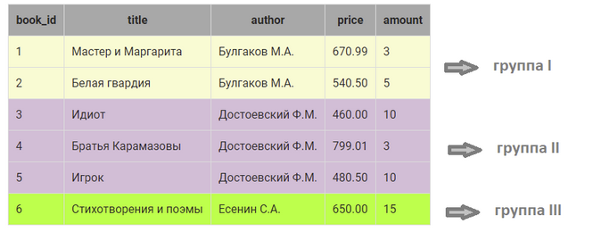
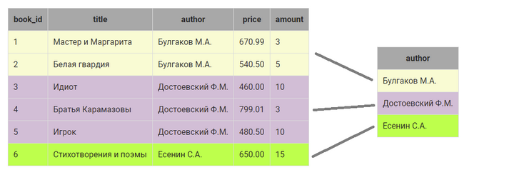
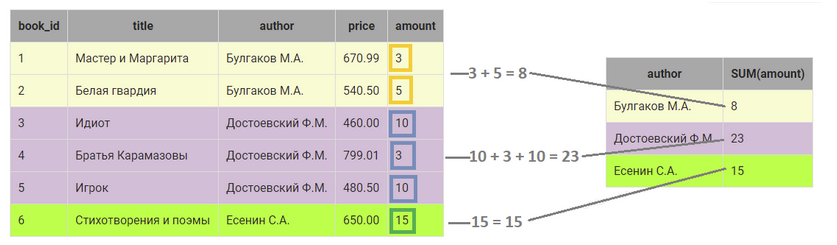
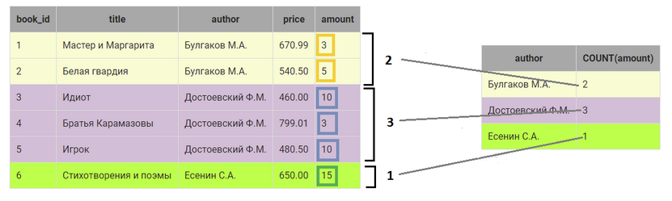

# Основы реляционной модели и SQL

## 1.3 Запросы, групповые операции

## Содержание урока

SQL запросы позволяют производить вычисления не только для каждой строки таблицы, но и для группы элементов, расположенных в одном столбце. Для этого используются групповые (агрегатные) функции.

- [выборка-уникальных-элементов-столбца](#выборка-уникальных-элементов-столбца)
- [выборка-данных-групповые-функции-sum-и-count](#выборка-данных-групповые-функции-sum-и-count)
- [выборка-данных-групповые-функции-min-max-и-avg](#выборка-данных-групповые-функции-min-max-и-avg)
- [выборка-данных-с-вычислением-групповые-функции](#выборка-данных-с-вычислением-групповые-функции)
- [вычисления-по-таблице-целиком](#вычисления-по-таблице-целиком)
- [выборка-данных-по-условию-групповые-функции](#выборка-данных-по-условию-групповые-функции)
- [выборка-данных-по-условию-групповые-функции-WHERE-и-HAVING](#выборка-данных-по-условию-групповые-функции-where-и-having)


**Структура и наполнение таблицы**

|             book_id            |         title         |      author      |     price    | amount |
|:------------------------------:|:---------------------:|:----------------:|:------------:|:------:|
| INT PRIMARY KEY AUTO_INCREMENT |      VARCHAR(50)      |    VARCHAR(30)   | DECIMAL(8,2) |   INT  |
| 1                              | Мастер и Маргарита    | Булгаков М.А.    | 670.99       | 3      |
| 2                              | Белая гвардия         | Булгаков М.А.    | 540.50       | 5      |
| 3                              | Идиот                 | Достоевский Ф.М. | 460.00       | 10     |
| 4                              | Братья Карамазовы     | Достоевский Ф.М. | 799.01       | 3      |
| 5                              | Игрок                 | Достоевский Ф.М. | 480.50       | 10     |
| 6                              | Стихотворения и поэмы | Есенин С.А.      | 650.00       | 15     |


## Выборка-уникальных-элементов-столбца

[Содержание ↑](#содержание-урока)

Чтобы отобрать уникальные элементы некоторого столбца используется ключевое слово `DISTINCT`, которое размещается сразу после `SELECT`.

**Пример**

Выбрать различных авторов, книги которых хранятся в таблице book.

```sql
select distinct author
from edu.book;
```

Результат

| author           |
|:----------------:|
| Булгаков М.А.    |
| Достоевский Ф.М. |
| Есенин С.А.      |


Другой способ – использование оператора `GROUP BY`, который группирует данные при выборке, имеющие одинаковые значения в некотором столбце. Столбец, по которому осуществляется группировка, указывается после `GROUP BY`.


С помощью `GROUP BY` можно выбрать уникальные элементы столбца, по которому осуществляется группировка. Результат будет точно такой же как при использовании `DISTINCT`.

```sql
select author
from edu.book
group by author;
```


## Выборка-данных-групповые-функции-sum-и-count

[Содержание ↑](#содержание-урока)

При группировке над элементами столбца, входящими в группу можно выполнить различные действия, например, просуммировать их или найти количество элементов в группе.
Подробно рассмотрим, как осуществляется группировка данных по некоторому столбцу и вычисления над группой на следующем примере:

```sql
select author, sum(price), count(amount)
from edu.book
group by author;
```

1. В таблице `book` определяются строки, в которых в столбце author одинаковые значения:
>

Получили 3 различные группы:

- группа I объединяет две записи, у которых в столбце author значение Булгаков М.А.;
- группа II объединяет три записи, у которых в столбце author значение Достоевский Ф.М.;
- группа III объединяет одну запись, у которой в столбце author значение Есенин С.А.

2. Вместо каждой группы в результирующий запрос включается  одна запись. Запись как минимум включает значение столбца, по которому осуществляется группировка (в нашем случае это `author`):

>

3. Дальше можно выполнить вычисления над элементами КАЖДОЙ группы в отдельности, например, посчитать общее количество экземпляров книг каждого автора. Для этого используется групповая функция `SUM()`, а в скобках указывается столбец, по которому нужно выполнить суммирование ( в нашем случае `amount`):

>

4. Также можно посчитать, сколько записей относится к группе. Для этого используется функция `COUNT()`, в скобках можно указать `ЛЮБОЙ` столбец из группы, если группа не содержит пустых значений (ниже приведен пример, в котором показано, как работает `COUNT()`, если в группе есть пустые значения):

>


**Пример**

Посчитать, сколько экземпляров книг каждого автора хранится на складе.

```sql
select author, sum(amount)
from edu.book
group by author;
```

| author           | SUM(amount) |
|:----------------:|:-----------:|
| Булгаков М.А.    | 8           |
| Достоевский Ф.М. | 23          |
| Есенин С.А.      | 15          |

> Обратите внимание, что в качестве названия вычисляемого столбца в результирующей таблице используется выражение. Рекомендуется всем  вычисляемым столбцам давать имя.


**Пример**

Посчитать, сколько различных книг каждого автора хранится на складе.

Только для этого примера в таблицу book добавлена запись с пустыми значениями в столбцах amount и price:

```sql
select author, count(author), count(amount), count(*)
from edu.book
group by author;
```

| author           | COUNT(author) | COUNT(amount) | COUNT(*) |
|:----------------:|:-------------:|:-------------:|:--------:|
| Булгаков М.А.    | 2             | 2             | 2        |
| Достоевский Ф.М. | 3             | 3             | 3        |
| Есенин С.А.      | 2             | 1             | 2        |


Из таблицы с результатами запроса видно, что функцию `COUNT()` можно применять к любому столбцу, в том числе можно использовать и `*`, если таблица не содержит пустых значений. Если же в столбцах есть значения `Null`, (для группы по автору Есенин в нашем примере), то
- `COUNT(*)` —  подсчитывает  все записи, относящиеся к группе, в том числе и со значением NULL;
- `COUNT(имя_столбца)` — возвращает количество записей конкретного столбца (только `NOT NULL`), относящихся к группе.

> ВАЖНО!
> - Если столбец указан в SELECT  БЕЗ применения групповой функции, то он обязательно должен быть указан и вGROUP BY.Иначе получим ошибку.

Если названия книг для одного и того же автора повторяются, а требуется посчитать количество уникальных наименований, можно использовать ключевое слово DISTINCT в агрегатной функции (и не только в COUNT).

```sql
SELECT
    author,
    COUNT(DISTINCT title)
FROM book
GROUP BY author;

```


## Выборка-данных-групповые-функции-min-max-и-avg

[Содержание ↑](#содержание-урока)


К групповым функциям SQL относятся: `MIN()`, `MAX()` и `AVG()`, которые вычисляют минимальное, максимальное и среднее значение элементов столбца, относящихся к группе.

**Пример:**

Вывести минимальную цену книги каждого автора

```sql
select author, min(price) as min_price
from edu.book
group by author;
```

| author           | min_price |
|:----------------:|:---------:|
| Булгаков М.А.    | 540.50    |
| Достоевский Ф.М. | 460.00    |
| Есенин С.А.      | 650.00    |

## Выборка-данных-с-вычислением-групповые-функции

[Содержание ↑](#содержание-урока)

В качестве аргумента групповых функций  SQL может использоваться не только столбец, но и любое допустимое в SQL арифметическое выражение.

**Пример**

Вывести суммарную стоимость книг каждого автора.

```sql
select
    author,
    sum(price * amount) as Стоимость
from edu.book
group by author;

```
| author           | Стоимость |
|:----------------:|:---------:|
| Булгаков М.А.    | 4715.47   |
| Достоевский Ф.М. | 11802.03  |
| Есенин С.А.      | 9750.00   |

Групповые функции могут быть элементами выражений. Например, при вычислении средней стоимости книг каждого автора на предыдущем шаге получились значения с шестью знаками после запятой. А поскольку это деньги, значения нужно округлить до 2 знаков после запятой.

```sql
select
    author,
    round(avg(price),2) as Средняя_цена
from edu.book
group by author;
```

| author           | Средняя_цена |
|:----------------:|:------------:|
| Булгаков М.А.    | 605.75       |
| Достоевский Ф.М. | 579.84       |
| Есенин С.А.      | 650.00       |


## Вычисления-по-таблице-целиком

[Содержание ↑](#содержание-урока)


Групповые функции позволяют вычислять итоговые значения по всей таблице. Например, можно посчитать общее количество книг на складе, вычислить суммарную стоимость и пр. Для этого после ключевого слова `SELECT` указывается групповая функция для выражения или имени столбца, а ключевые слова `GROUP BY` опускаются.

**Пример**

Посчитать количество экземпляров книг на складе.

```sql
select sum(amount) as количество
from edu.book;
```

| Количество |
|:----------:|
| 46         |

> Результатом таких запросов является единственная строка с вычисленными по таблице значениями.

**Пример**

Посчитать общее количество экземпляров книг на складе и их стоимость .

```sql
select sum(amount),
    sum(amount * price) as Стоимость
from edu.book;
```

| Количество | Стоимость |
|:----------:|:---------:|
| 46         | 26267.50  |


## Выборка-данных-по-условию-групповые-функции

[Содержание ↑](#содержание-урока)

В запросы с групповыми функциями можно включать условие отбора строк, которое в обычных запросах записывается после `WHERE`. В запросах с групповыми функциями вместо `WHERE` используется ключевое слово `HAVING` , которое размещается после оператора `GROUP BY`.

**Пример**

Найти минимальную и максимальную цену книг всех авторов, общая стоимость книг которых больше 5000.

```sql
select author, min(price), max(price)
from edu.book
group by author
having sum(price * amount) > 5000;
```

| author           | Минимальная_цена | Максимальная_цена |
|:----------------:|:----------------:|:-----------------:|
| Достоевский Ф.М. | 460.00           | 799.01            |
| Есенин С.А.      | 650.00           | 650.00            |


Также в запросах с группировкой можно сортировать данные.

**Пример**

Найти минимальную и максимальную цену книг всех авторов, общая стоимость книг которых больше 5000. Результат вывести по убыванию минимальной цены.

```sql
select 
    author,
    min(price) AS Минимальная_цена,
    max(price) as Максимальная_цена
from edu.book
group by author
having sum(price * amount) > 5000
order by Минимальная_цена desc;
```

| author           | Минимальная_цена | Максимальная_цена |
|:----------------:|:----------------:|:-----------------:|
| Есенин С.А.      | 650.00           | 650.00            |
| Достоевский Ф.М. | 460.00           | 799.01            |


> При указании столбца, по которому выполняется сортировка, если столбцу присвоено имя  с помощью AS, можно использовать это имя.

## Выборка-данных-по-условию-групповые-функции-WHERE-и-HAVING

[Содержание ↑](#содержание-урока)

`WHERE` и `HAVING` могут использоваться в одном запросе. При этом необходимо учитывать порядок выполнения  SQL запроса на выборку на СЕРВЕРЕ:

**MySQL**

1. FROM
2. WHERE
3. GROUP BY
4. HAVING
5. SELECT
6. ORDER BY

**PostgreSQL**
FROM => WHERE = GROUP BY = HAVING = SELECT = DISTINCT = ORDER BY = LIMIT.


Сначала определяется таблица, из которой выбираются данные `(FROM)`, затем из этой таблицы отбираются записи в соответствии с условием  `WHERE`, выбранные данные агрегируются `(GROUP BY)`,  из агрегированных записей выбираются те, которые удовлетворяют условию после `HAVING`. Потом формируются данные результирующей выборки, как это указано после `SELECT` ( вычисляются выражения, присваиваются имена и пр. ). Результирующая выборка сортируется, как указано после `ORDER BY`.

> **ВАЖНО!** Порядок ВЫПОЛНЕНИЯ запросов - это не порядок ЗАПИСИ ключевых слов в запросе на выборку. Порядок записи (синтаксис запроса) остается таким же, как рассматривался ранее в курсе. Порядок ВЫПОЛНЕНИЯ  нужен для того, чтобы понять, почему, например, в `WHERE` нельзя использовать имена выражений из `SELECT`. Просто `SELECT` выполняется компилятором позже, чем `WHERE`, поэтому ему неизвестно, какое там выражение написано.


**Пример**

Вывести максимальную и минимальную цену книг каждого автора, кроме Есенина, количество экземпляров книг которого больше 10. 

```sql
select author,
    min(price) as Минимальная_цена,
    max(price) as Максимальная_цена
from edu.book
where author not ilike 'Есенин%'
group by author
having sum(amount) > 10;


-- эквивалент - bad
select author,
    min(price) as Минимальная_цена,
    max(price) as Максимальная_цена
from edu.book
group by author
having author not ilike 'Есенин%' and sum(amount) > 10;

```

| author           | Минимальная_цена | Максимальная_цена |
|:----------------:|:----------------:|:-----------------:|
| Достоевский Ф.М. | 460.00           | 799.01            |


> Не смотря на то что результат будет одинаковым, так делать не рекомендуется. «Потому что как написано - запрос сначала выбирает всех авторов, потом выводит данные, рассчитывая минимальное и максимальное значение цены для каждого, и только после всего убирает Есенина. Можно убрать Есенина в данном случае раньше и не использовать ресурсы базы для расчета его минимального и максимального значения, как это сделано в первом варианте. На небольшой базе быстродействия не ощутить, но если выполнять такое на продуктивной, то второй вариант значительно проигрывает...»